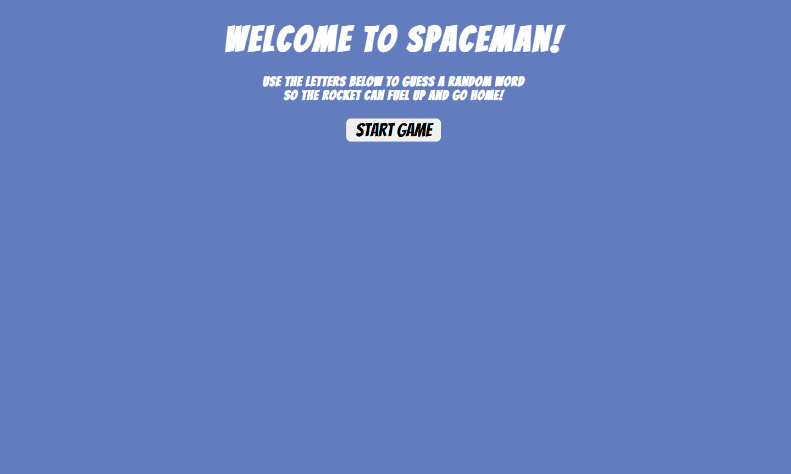

# Spaceman!
The object of this game is quite simple. Our rocket is running out of fuel, and we need to get home! In order to fuel up to rocket, you must guess the word before you run out of chances. 

## Final Screenshots of the Game

## Technology Used
    -HTML 
    -CSS
    -JavaScript

## Getting Started
    -The rules are simple. Click the button of the letter you want to guess. If correct the letter will show up on screen.
    -You have six spare guesses. On the 7th incorrect guess, the game is over!
    -HINT: Always start with the vowels if you are truely stuck.

### Attributions
Rocket Graphic Courtesy of Font Awesome

Link to the live demo of the game:
https://patmangan98.github.io/Project1/