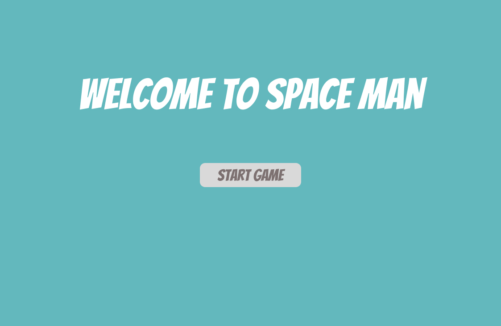
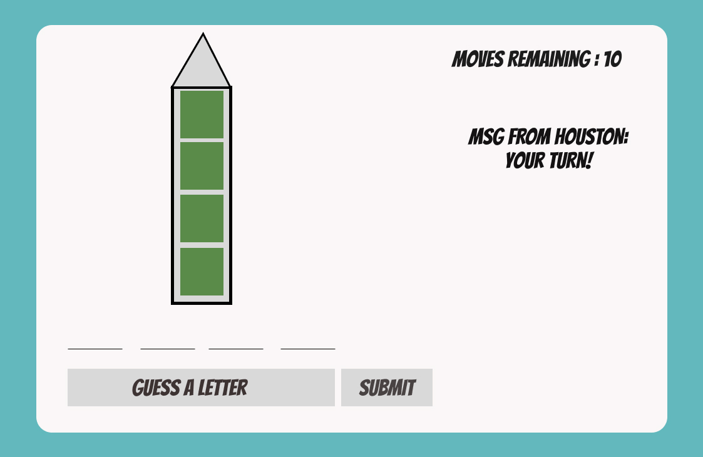
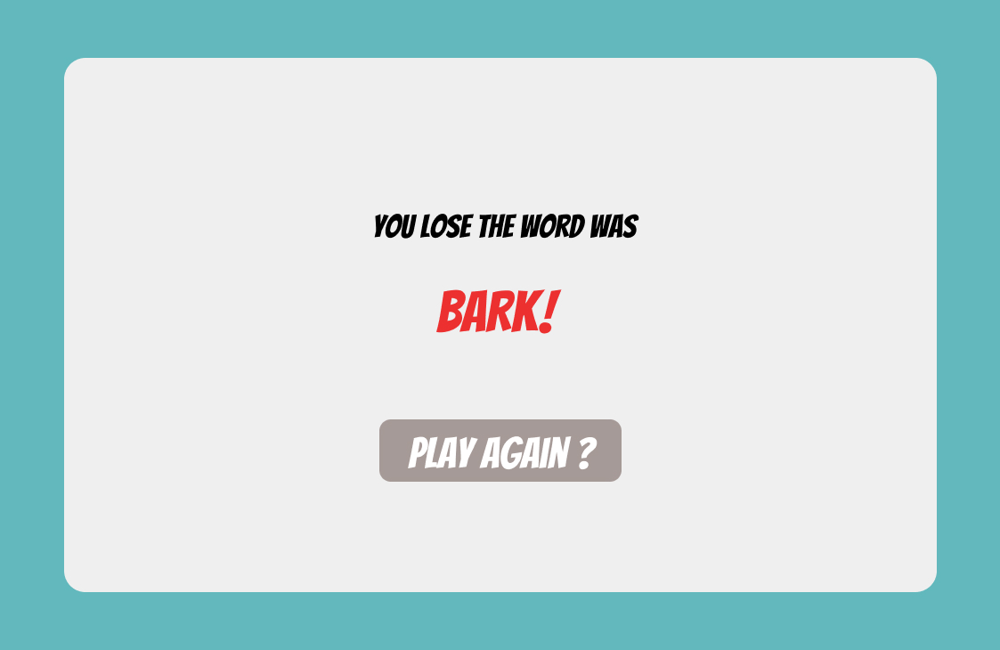

# Wire Frame

#
<h1> USER STATEMENTS FOR SPACEMAN:  As a user I want.. </h1>

<header>

## Version 1- MVP

- to see the rocket.
- to see the number of spaces that respresnt all the letters of the word
- to see my current correct guesses show up in the word spaces
- to have an input for a letter 
- to have a message if my guess was wrong 
- to have a start game button 
- to see a message when I win 
- to see a message when i loose
- to start a new game 
- to have a guess remaing counter 

## Version 2 

- to have a message if my guess was correct
- to have a hint button 
- to have the option to create phrases 
- to have a tally of how many games each player has won 
- to play against a computer 
- to see a rules/game explanation guide
- to be able to reset the game (in case someone mispells the word)
- to see my prior incorrect guesses show up in a blank space 

## Version 3

- to see a progress bar for refueling the rocket
- to see an animation when the rocket takes off
- to play against a difficult computer generated word 
- to have a level system where I land on different planets 
- to have the option to add extra guess attempts
- to have the option to set the number of allowed hints 
</header>

#
# Psuedo Code for MVP

### Delcare Contstants For The Game Controller

    CONST alpabet = "the alphabet stored in a string"

    CONST maxIncorrectGuesses = 6 + word[i].length

### Declare state variables to be updated in the init function

    let words = array of words to be chosen at random

    let randomWords = 

    let spaces = blank array

    let incorrectGuesses

    let gamerOver

    let corrrectGuess

### Declare Constants used for viewing the game 

    CONST wordSubmit = submit button for picking a word at random id wordSubmit

    CONST letterSubmit = submit button for the letter you want to guess, id Letter Submit 

    CONST Container = html div element with an id of container

    CONST Msg container = html p element inside container

    CONST newGame = html button element that will start a new game, id new game 
    
    CONST rocketDisplay = html div with id of rocketDisplay

### Initialize Function 

    CONST initialize = () => {
        let incorrectGuesses = 0
        let gameOver = false
        let word = ['Wizards', 'Commanders', 'Capitals', 'Nationals']
    }

    FOR LOOP (i < Word.length) {  
        spaces.push("_")
    }

### Game Logic 

    Const pick a word = (word arr) => {
        let randomWord = math.floor math.random() * word arr .length
    }

    While loop (gameOver is false) {

        create document element p

        set inter text to 'make a guess'

        appendChild to msgContainer

        search the wordElement for the value of guessElement 

        set let correctGuesses = false

      if (word{i}.search(guess) !== -1) {

         inorrectguesses == 1

            if the (index of the word === guess) {

                the index of spaces = guess
            } 
         }
        set correctGuess = true 
      }
    }
    if (correct guess is not true) {
        incorrectGuess++
    }
        
    if (spaces[i].search("_") = -1 && incorrectguesses >= maxIncorrectGuesses){
         gameOver = true
    }      
    if (gameOver = true && spaces[i].search("_") = -1 && incorrectguess >= maxIncorrectGuesses) {
        then update msgContainer to read `You lose the word was ${word}` { 
    } else {
        update move counter to read `You win the word was $`
    }

### Create render related functions 

    Const moveCounter {
        msgContainer innertext equals `${correctGuess + inorrectGuess}
    }

    CONST Pick A Word Screen = (wordarr) => { ///revise later
        create a new html element button
        setAttribute of the button to have an id of wordSubmit 
        appendChild to container 
    }

    newGame.addeventlistener('click', pick a word Screen) 
    
    CONST hideWordScreen = (event) => {
       set the CSS display attritbute of WordSubmit to none 
    }   

    wordSubmit.addEventListener('click', hideWordScreen)
    wordSubmit.addEventListener('click', pick a word)

    CONST loadGuess = (event) => {
        Letter input = create an input element
        .setAttribute of the letter input to type text
        .setAttribute the input letter id to guessElement
        create an new element for letter submit button
        .setAttribute letterSubmit button to type submit
        .setAttribute of the letter submit button to id letterSubmit 
    }

    CONST showCurrentStatus = () => 

    CONST createRocket = () => {
        create div with id of rocket piece 
        set background of css to rocket url
        .appendchild() to RocketDisplay
    }

    CONST createSpaces = (word) => { 
        CONST length equals word.length
        LET blank spaces = ""
        for loop(i < length) {
            spaces += "_"
        } 
        blankWordSpace = new paragrah element to hold the word to be guessed
        assign an ID to the newly created element (BlankSpace)
        blankWordSpace.innertext = value of the variable spaces
    }
                    

    Const render = () => {
        loadGuess()
        createRocket()
        loadPreviousLetters()
        initalize()
        createRocket()
        createSpaces()
    }

    wordSubmit.addEventListener('click', render)

    
    CONST createSpaces = (word) => { 
        CONST length equals word.length
        LET blank spaces = ""
        for loop(i < length) {
            spaces += "_"
        } 
        blankWordSpace = new paragrah element to hold the word to be guessed
        assign an ID to the newly created element (BlankSpace)
        blankWordSpace.innertext = value of the variable spaces
    }

